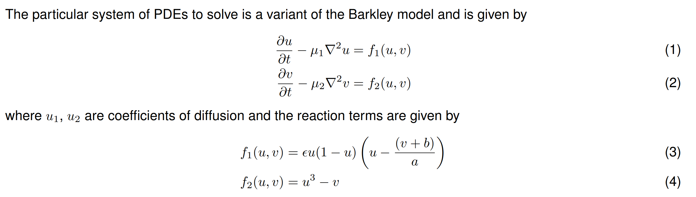
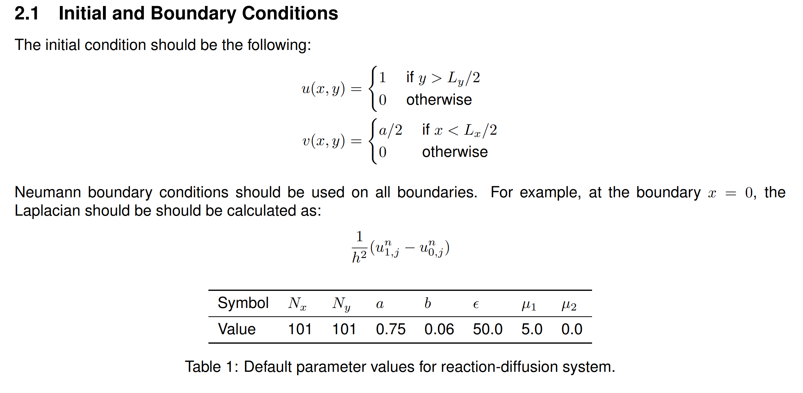

# Introduction

This program solves the 2D reaction-diffusion problem using a discretised form of the Barkley model. It uses Central Finite Differences and forward Euler for time integration.

The discretised form of the equations are as follows:

When performing the iteration, the initial and boundary conditions are as follows:

## Software Design

The data pipeline has been designed to take advantage of OOP concepts such as abstraction and encapsulation. This way, data can be passed from one object/method to another, making it easy to identify computational bottlenecks where parallelism can be applied. This will reduce the *time-to-solution* of the program.

